.. |doctest| replace:: :mod:`doctest`
.. |date| date:: %d-%m-%Y
.. |time| date:: %H:%M

.. |qg| replace:: :mod:`QGIS`
.. _qg: http://qgis.org

.. _contributors: https://github.com/Oslandia/qgis-versioning/graphs/contributors

.. |plugin| replace:: :mod:`qgis-versioning plugin`
.. _plugin: https://github.com/Oslandia/qgis-versioning

.. _original page: http://www.oslandia.com/qgis-versioning-plugin-en.html

.. |CC| image:: images/CC-BY-SA-4-0.png
.. _CC: http://creativecommons.org/licenses/by-sa/4.0/

.. _eHA: http://www.ehealthafrica.org/
.. _oslandia: http://www.oslandia.com/

.. |spatialite-logo| image:: images/spatialite-logo.png
.. _spatialite-logo: https://www.gaia-gis.it/fossil/libspatialite/index

.. _postgis-logo: http://postgis.net/
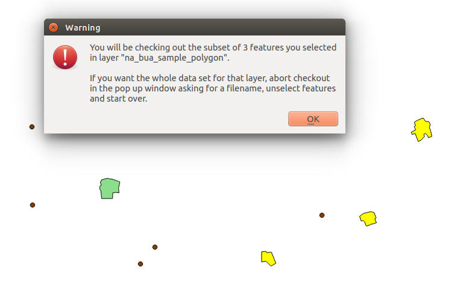
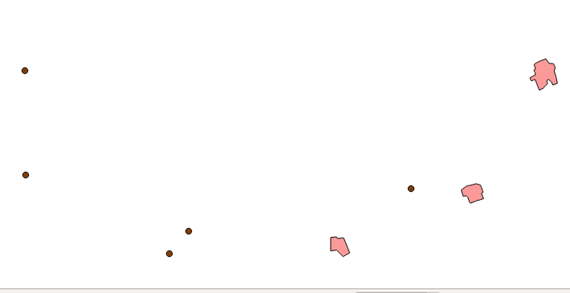

.. |view_png| image:: images/view.png

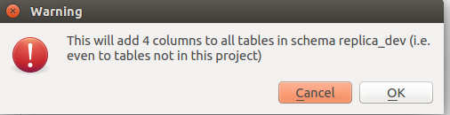

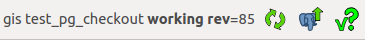

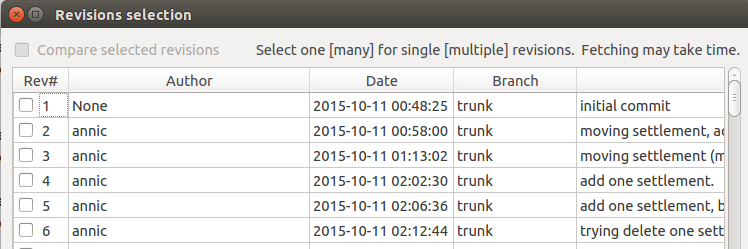
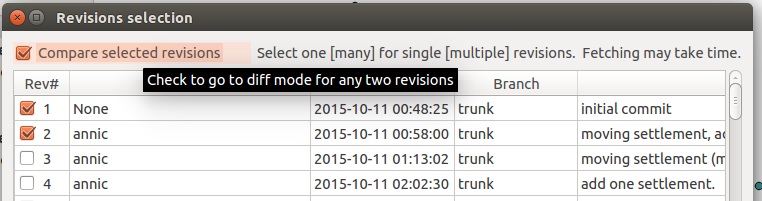
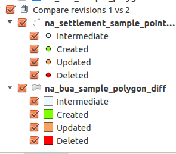
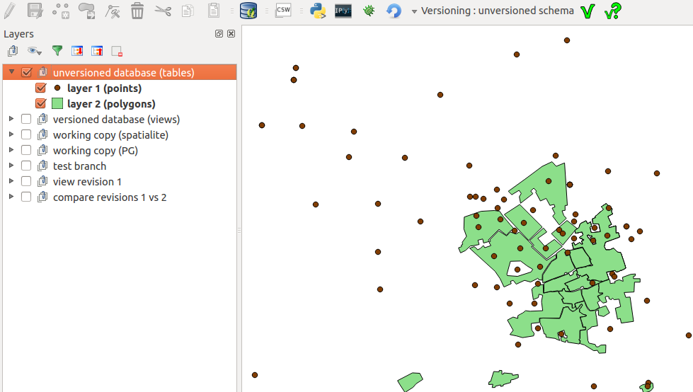
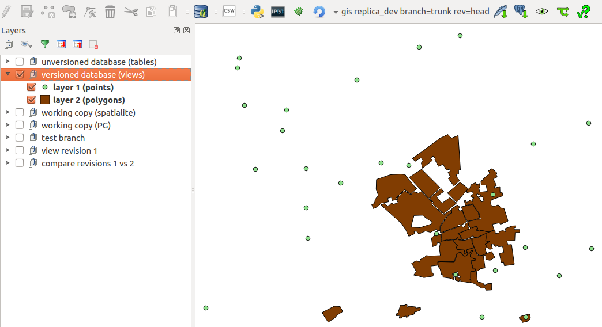
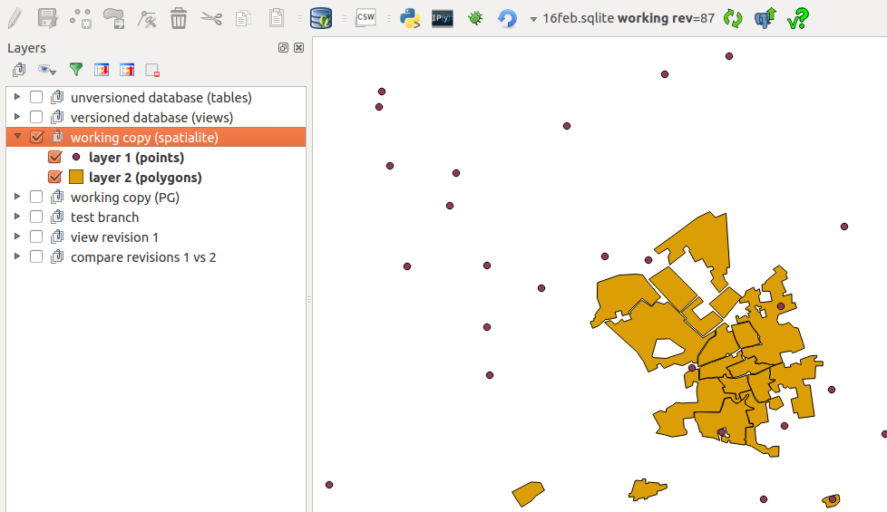
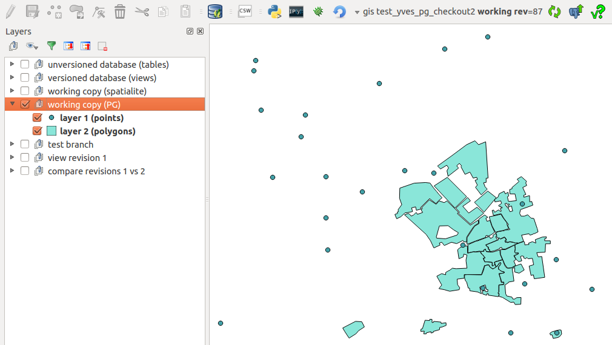
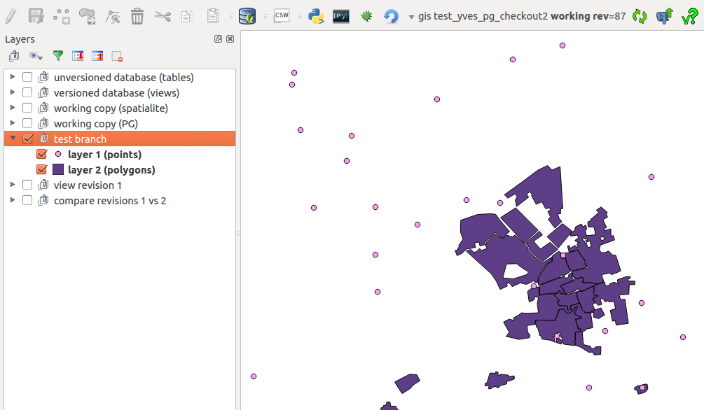
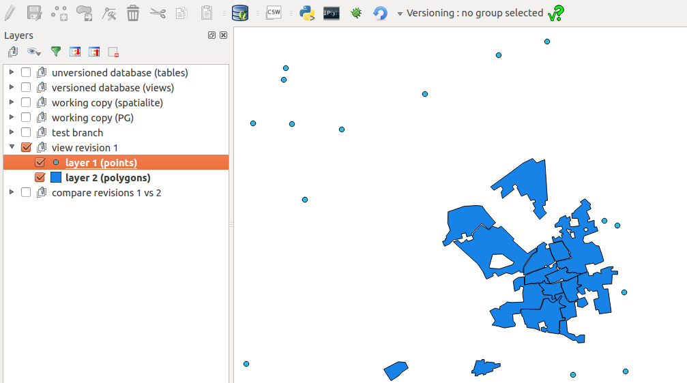
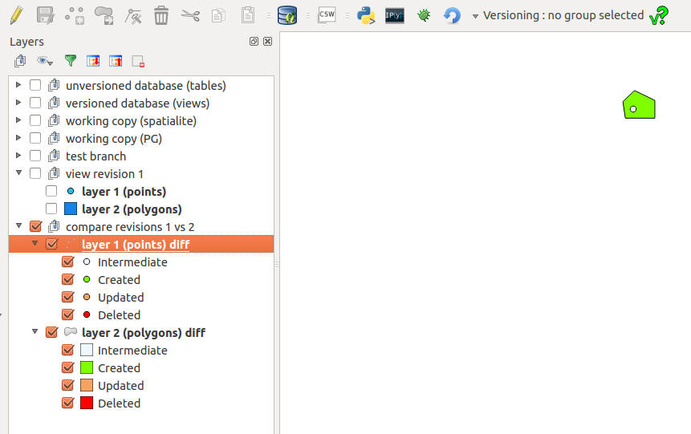
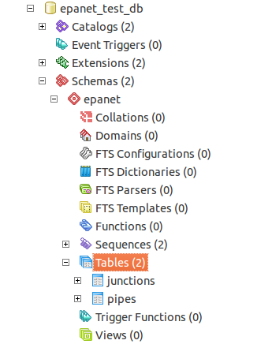
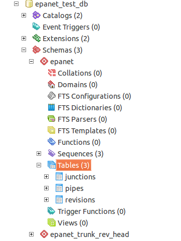
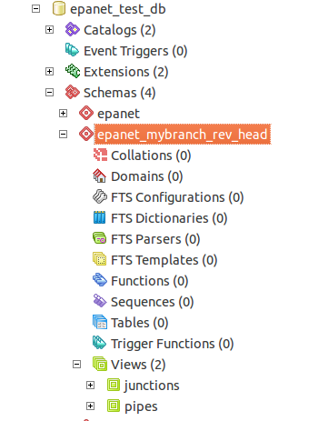
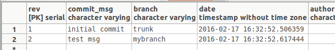
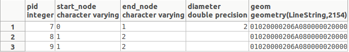
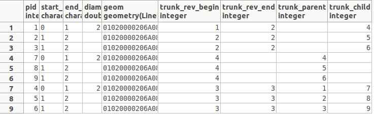
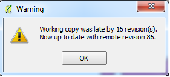
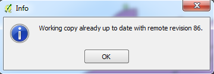
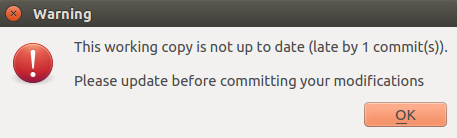
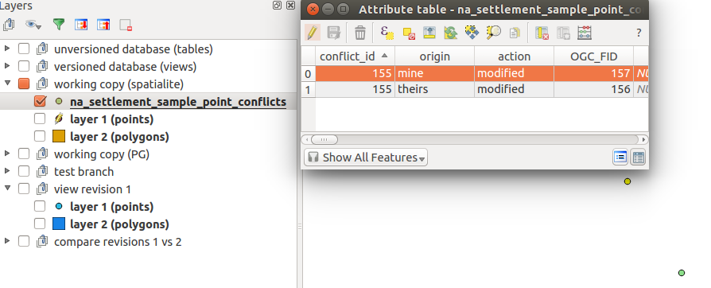
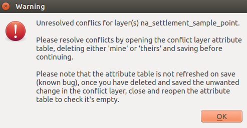
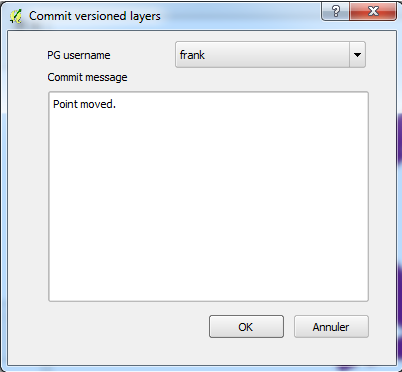
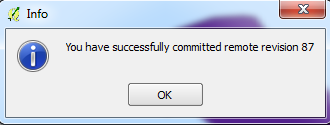
